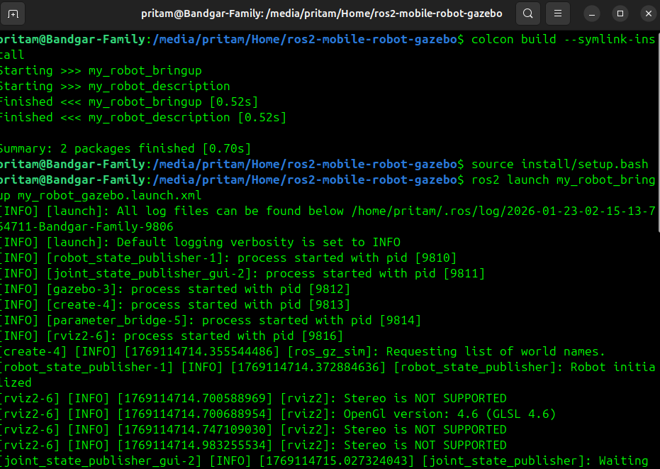
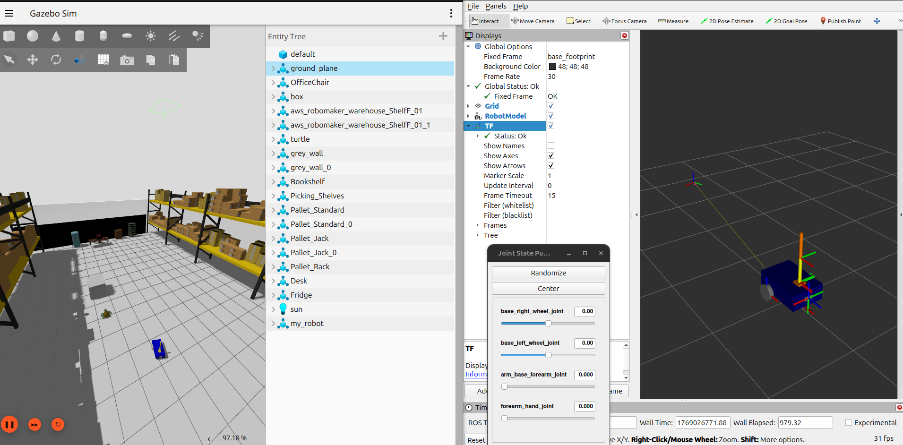
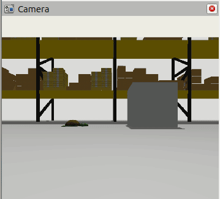
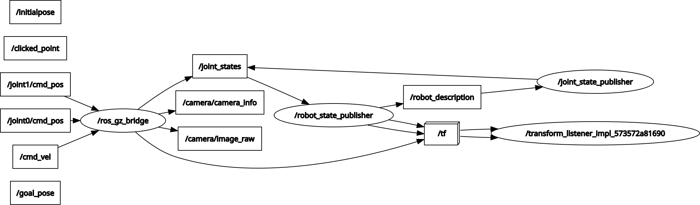
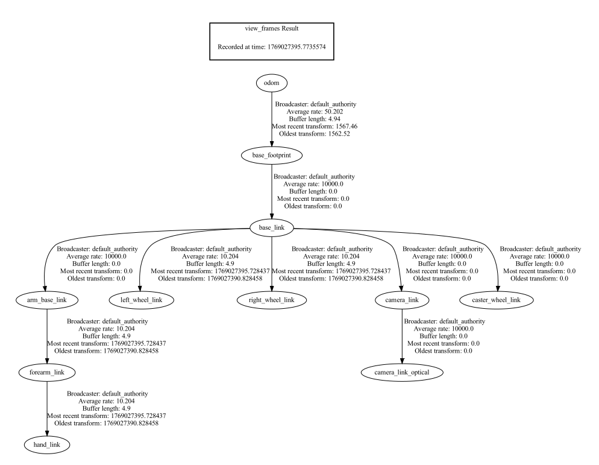

# 🤖 ROS2 Mobile Robot with 2-DOF Arm – Gazebo Simulation


A complete ROS2 robotics simulation featuring a **differential-drive mobile robot** with a **simple 2-DOF arm** and **camera sensor** in Gazebo Harmonic. Includes teleoperation control, sensor integration, and complete URDF modeling.

---

## 🎥 Demo


**Features:**
- Differential-drive mobile base with teleoperation
- Simple 2-DOF arm with position control
- RGB camera with live feed
- Complete ROS2-Gazebo integration
- Modular URDF/Xacro design

---

## 🚀 Quick Start

### Prerequisites
- Ubuntu 24.04 LTS
- ROS2 Jazzy
- Gazebo Harmonic

### Installation

# Install ROS2 Jazzy
  ```
  sudo apt install ros-jazzy-desktop
  ```

# Install Gazebo Harmonic
  ```
  sudo apt install gz-harmonic
  ```

# Install dependencies
 ```bash
  sudo apt install -y \
  ros-jazzy-robot-state-publisher \
  ros-jazzy-ros-gz-sim \
  ros-jazzy-ros-gz-bridge \
  ros-jazzy-xacro \
  ros-jazzy-rviz2 \
  ros-jazzy-teleop-twist-keyboard
  ```
# Build workspace
```bash
 cd ~/ros2_ws
 colcon build --symlink-install
 source install/setup.bash
 ```

### Run Simulation

# Launch Gazebo + RViz
 ```
 ros2 launch my_robot_bringup my_robot_gazebo.launch.xml
 ```
# Control robot (new terminal)
 ```
 ros2 run teleop_twist_keyboard teleop_twist_keyboard
 ``` 
# Use: i=forward, j=left, l=right, k=stop

# Control arm
 ```
 ros2 topic pub -1 /joint0/cmd_pos std_msgs/msg/Float64 "data: 1.57"
 ```

 ```
 ros2 topic pub -1 /joint1/cmd_pos std_msgs/msg/Float64 "data: 0.785"
 ```

---

## 📂 Project Structure

```
ros2-mobile-robot-gazebo/
├── my_robot_description/
│   ├── urdf/
│   ├── launch/
│   ├── rviz/
│   ├── CMakeLists.txt
│   └── package.xml
├── my_robot_bringup/
│   ├── launch/
│   ├── config/
│   ├── worlds/
│   ├── CMakeLists.txt
│   └── package.xml
├── screenshots/
├── videos/
├── README.md
├── QUICKSTART.md
└── ARCHITECTURE.md
```

---

## 🎮 Usage

### Keyboard Teleoperation
    
    ```
       i            Move forward
    j  k   l      Turn left / Stop / Turn right
       ,            Move backward
    ```

### ROS2 Commands

# View topics
 ```
 ros2 topic list
 ```
# Check robot state
 ```
 ros2 topic echo /joint_states`
 ```
# View TF tree
 ```
 ros2 run tf2_tools view_frames`
 ```
# System graph
 ```
 rqt_graph
 ```
---

## 🧠 Key Concepts

**What This Project Demonstrates:**
- ✅ URDF/Xacro robot modeling
- ✅ TF tree management
- ✅ ROS2-Gazebo Harmonic integration
- ✅ Sensor integration (camera)
- ✅ Teleoperation control
- ✅ Launch file orchestration

**Technologies:**
- ROS2 Jazzy | Gazebo Harmonic | Ubuntu 24.04 | Python 3.12

---

## 📸 Screenshots

**System Launch:**



---

**Simulation Environment:**



---

**Camera Sensor Working:**



---

**System Architecture:**



---

**TF Tree:**



---

## 🛠 Troubleshooting

**Gazebo won't start:**
```bash
killall -9 gz
rm -rf ~/.gz/sim
```

**Camera not working:**
Add this plugin to your `.sdf` world file:
```xml
<plugin filename="gz-sim-sensors-system" 
        name="gz::sim::systems::Sensors">
  <render_engine>ogre2</render_engine>
</plugin>
```

**Build errors:**
```bash
rm -rf build install log 
colcon build --symlink-install
source install/setup.bash
```

More help: See [QUICKSTART.md](QUICKSTART.md) and [ARCHITECTURE.md](ARCHITECTURE.md)

---

## 🔧 Key Learnings

During development, I gained hands-on experience with several technical challenges:

**Gazebo Sensor Configuration**
- Debugged camera sensor not publishing images despite topic existence
- Solution: Added `gz-sim-sensors-system` plugin to custom SDF world file
- Learning: Custom Gazebo worlds require explicit sensor plugin configuration for all sensors

**ROS2-Gazebo Bridge Setup**
- Configured bidirectional topic mappings between ROS2 and Gazebo Harmonic
- Matched exact Gazebo topic names (world/model hierarchy) in bridge YAML
- Learning: Topic naming conventions differ between ROS2 and Gazebo

**Systematic Debugging Approach**
- Used diagnostic tools: `ros2 topic info`, `gz topic -l`, `rqt_graph`
- Leveraged AI assistance (Gemini) for configuration analysis
- Learning: Methodical troubleshooting with proper tools saves significant time

---

## 🚀 Possible Improvements

- Add Nav2 for autonomous navigation
- Integrate SLAM
- Add LiDAR sensor
- Add gripper end-effector to the arm
- Improve arm joint control
- Multi-robot simulation

---

## 📚 Resources

- **Reference curriculum**: [ROS2 For Beginners (Level 2) - Edouard Renard (Udemy)](https://www.udemy.com/course/ros2-for-beginners/)
- [ROS2 Jazzy Docs](https://docs.ros.org/en/jazzy/)
- [Gazebo Harmonic Docs](https://gazebosim.org/docs/harmonic)
- [URDF Tutorials](http://wiki.ros.org/urdf/Tutorials)

---

## 📜 Credits

This repository was developed as a **guided implementation project** aligned with **ROS2 For Beginners (Level 2)** by **Edouard Renard (Udemy)**.  
The intent is to demonstrate **end-to-end simulation integration** (URDF/Xacro, TF, ROS2 ↔ Gazebo bridging, sensors, launch orchestration) with a documented debugging workflow—beyond simply launching an example.


**Author:** Pritam Bandgar  
**GitHub:** [@Preetbandgar](https://github.com/Preetbandgar)  
**License:** Apache-2.0

---

## 📞 Support

Issues? Check [Troubleshooting](#troubleshooting) or open a GitHub issue.

**Happy Robotics! 🤖🚀**
